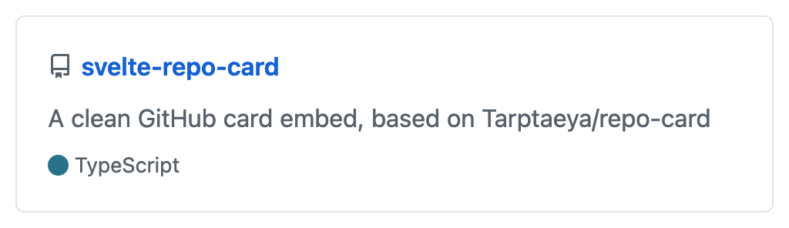
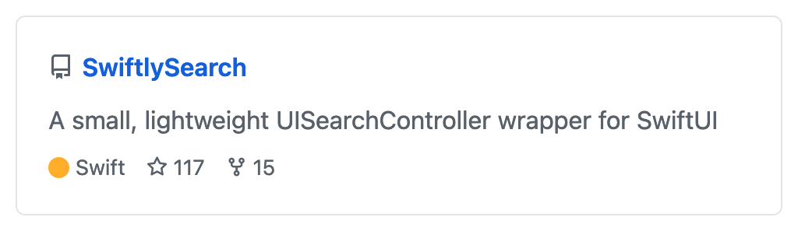

# svelte-repo-card

<p align="center">
  <a href="https://github.com/semantic-release/semantic-release"
    ></a
  >
  <a href="https://github.com/thislooksfun/svelte-repo-card/releases/latest"
    ></a
  >
  <a href="https://github.com/thislooksfun/svelte-repo-card/releases"
    ></a
  >
  <a href="#"
    ></a
  >
  <a href="https://github.com/thislooksfun/svelte-repo-card/blob/master/LICENSE"
    ></a
  >
</p>

<p align="center">
  <a href="https://www.npmjs.com/package/svelte-repo-card?activeTab=versions"
    ></a
  >
  <a href="https://github.com/thislooksfun/svelte-repo-card/tree/master/types"
    ></a
  >
  <a href="https://www.npmjs.com/package/svelte-repo-card"
    ></a
  >
  <a href="https://www.npmjs.com/package/svelte-repo-card?activeTab=dependents"
    ></a
  >
</p>

A simple GitHub repo card component based on [Tarptaeya/repo-card](https://github.com/Tarptaeya/repo-card).

## Installation

```
npm i -D svelte-repo-card
```

## Usage

```svelte
<script>
  import RepoCard from "svelte-repo-card";
</script>

<RepoCard slug="<user>/<repo>" />
```

It's that simple!

### Theming

If you want to control the appearance of the card you have three options:

1. Pass `"light"` or `"dark"` to the `theme` attribute to use the built-in light and dark themes.

```svelte
<RepoCard slug="<user>/<repo>" theme="light" />
<RepoCard slug="<user>/<repo>" theme="dark" />
```

2. Pass a full custom object.

```svelte
<script lang="ts">
  // {...}

  import type { Theme } from "svelte-repo-card";
  const theme: Theme = {
    // The color of the text.
    text: "#586069",

    // The color of the links.
    link: "#0366d6",

    // The background color.
    background: "#ffffff",

    // The border color.
    border: "#e1e4e8",
  };
</script>

<RepoCard slug="<user>/<repo>" {theme} />
```

3. Use the `--svc-*` css variables:

```css
:root {
  --svc-text-primary: #586069;
  --svc-text-link: #0366d6;
  --svc-background: #ffffff;
  --svc-border-color: #e1e4e8;
}
```

## Examples

1. `<RepoCard slug="thislooksfun/svelte-repo-card" />`: 
1. `<RepoCard slug="thislooksfun/SwiftlySearch" />`: 
